# ThesisFlow User Flows Documentation

**Date:** 2025-11-24  
**Purpose:** Document the three primary user personas and their interaction flows with the ThesisFlow platform.

---

## Overview

ThesisFlow serves three distinct user roles, each with specific responsibilities and workflows:

1. **Admin/Secretaría** - Administrative personnel managing the system catalog and project lifecycle
2. **Professor** - Faculty members creating/updating research projects and assigning students
3. **Student** - Researchers browsing available projects and viewing analytics

This document describes each flow in detail with supporting architecture diagrams.

---

## 1. Admin/Secretaría User Flow

### Purpose
Administrative personnel (secretarios) manage the core catalog of the platform: storing and maintaining professors, students, projects, careers, domains, and tags. They also handle bulk imports, backups, and system maintenance.

### Key Responsibilities
- Create and manage professor accounts
- Import/export project datasets
- Create and update project master data
- Manage academic careers and application domains
- Define project tags/topics
- Perform system backups and restoration
- Manage student records (optional, imported via bulk)

### User Flow Diagram

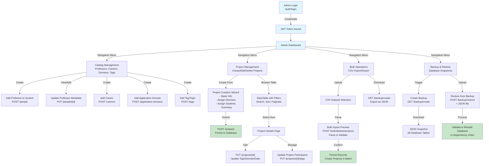
```mermaid
graph TD
    A["Admin Login<br/>/auth/login"] -->|Credentials| B["JWT Token Issued"]
    B --> C["Admin Dashboard"]
    C -->|Navigation Menu| D["Catalog Management<br/>Professors, Careers, Domains, Tags"]
    C -->|Navigation Menu| E["Project Management<br/>Create/Edit/Delete Projects"]
    C -->|Navigation Menu| F["Bulk Operations<br/>CSV Import/Export"]
    C -->|Navigation Menu| G["Backup & Restore<br/>Database Snapshots"]
    
    D -->|Create| H["Add Professor to System<br/>POST /people"]
    D -->|View/Edit| I["Update Professor Metadata<br/>PUT /people/{id}"]
    D -->|Create| J["Add Career<br/>POST /careers"]
    D -->|Create| K["Add Application Domain<br/>POST /application-domains"]
    D -->|Create| L["Add Tag/Topic<br/>POST /tags"]
    
    E -->|Create Form| M["Project Creation Wizard<br/>- Basic Info<br/>- Assign Directors<br/>- Assign Students<br/>- Summary"]
    M -->|Submit| N["POST /projects<br/>Persist to Database"]
    E -->|Browse Table| O["DataTable with Filters<br/>Search, Sort, Paginate"]
    O -->|Select Row| P["Project Details Page"]
    P -->|Edit| Q["PUT /projects/{id}<br/>Update Tags/Domain/Date"]
    P -->|Manage| R["Update Project Participants<br/>PUT /projects/{id}/tags"]
    
    F -->|Upload| S["CSV Dataset Selection"]
    S -->|Parse| T["Bulk Import Preview<br/>POST /bulk/dataset/projects<br/>Parse & Validate"]
    T -->|Confirm| U["Persist Records<br/>Create Projects in Batch"]
    F -->|Download| V["GET /backup/create<br/>Export as JSON"]
    
    G -->|Trigger| W["Create Backup<br/>GET /backup/create"]
    W -->|Download| X["JSON Snapshot<br/>All Database Tables"]
    G -->|Upload| Y["Restore from Backup<br/>POST /backup/restore<br/>+ JSON file"]
    Y -->|Process| Z["Validate & Rebuild Database<br/>In Dependency Order"]
    
    style A fill:#e1f5ff
    style B fill:#e1f5ff
    style C fill:#e1f5ff
    style N fill:#c8e6c9
    style U fill:#c8e6c9
    style Z fill:#c8e6c9
```

### Step-by-Step Flow: Creating a New Project

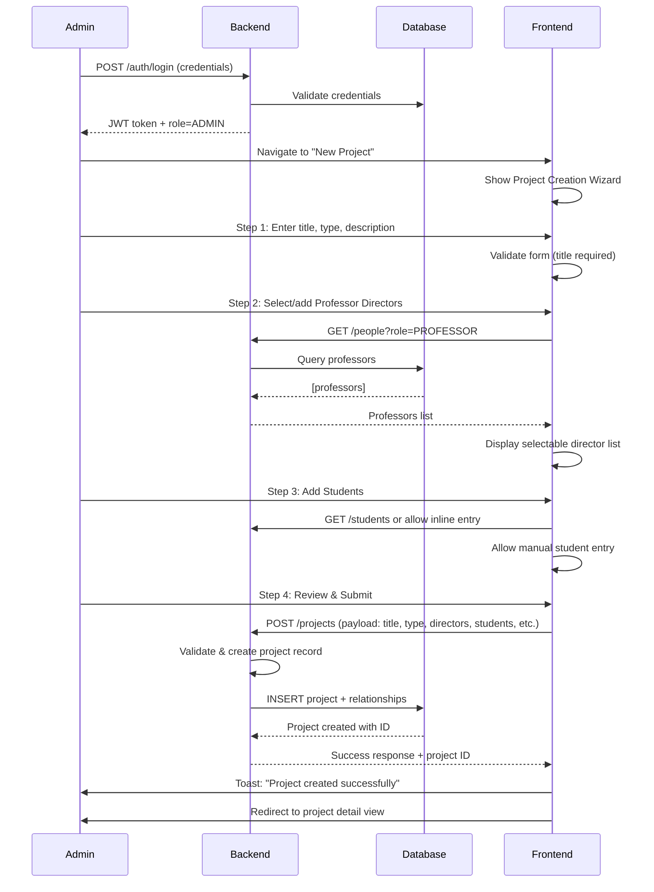
```mermaid
sequenceDiagram
    Admin->>Backend: POST /auth/login (credentials)
    Backend->>Database: Validate credentials
    Backend-->>Admin: JWT token + role=ADMIN
    
    Admin->>Frontend: Navigate to "New Project"
    Frontend->>Frontend: Show Project Creation Wizard
    
    Admin->>Frontend: Step 1: Enter title, type, description
    Frontend->>Frontend: Validate form (title required)
    
    Admin->>Frontend: Step 2: Select/add Professor Directors
    Frontend->>Backend: GET /people?role=PROFESSOR
    Backend->>Database: Query professors
    Database-->>Backend: [professors]
    Backend-->>Frontend: Professors list
    Frontend->>Frontend: Display selectable director list
    
    Admin->>Frontend: Step 3: Add Students
    Frontend->>Backend: GET /students or allow inline entry
    Frontend->>Frontend: Allow manual student entry
    
    Admin->>Frontend: Step 4: Review & Submit
    Frontend->>Backend: POST /projects (payload: title, type, directors, students, etc.)
    Backend->>Backend: Validate & create project record
    Backend->>Database: INSERT project + relationships
    Database-->>Backend: Project created with ID
    Backend-->>Frontend: Success response + project ID
    Frontend->>Admin: Toast: "Project created successfully"
    Frontend->>Admin: Redirect to project detail view
```

### Sub-Flow: Bulk Import

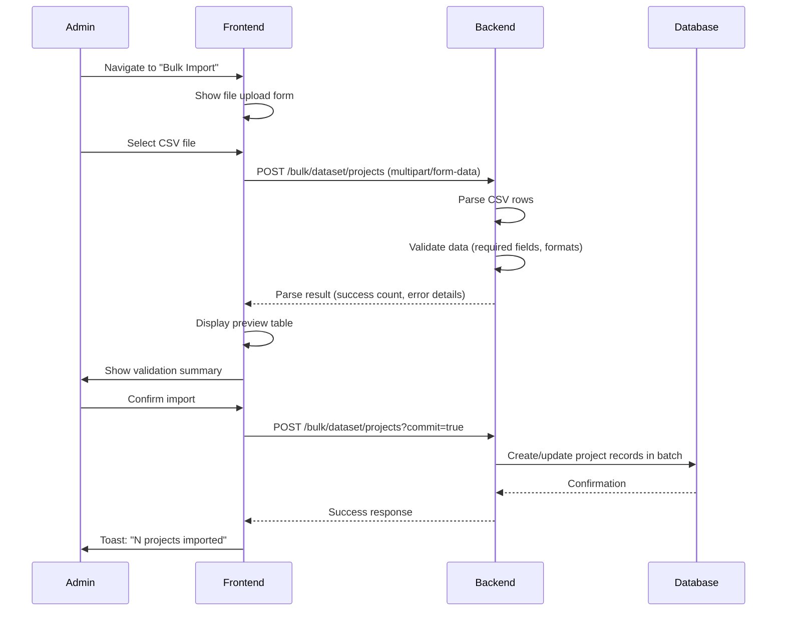
```mermaid
sequenceDiagram
    Admin->>Frontend: Navigate to "Bulk Import"
    Frontend->>Frontend: Show file upload form
    
    Admin->>Frontend: Select CSV file
    Frontend->>Backend: POST /bulk/dataset/projects (multipart/form-data)
    Backend->>Backend: Parse CSV rows
    Backend->>Backend: Validate data (required fields, formats)
    Backend-->>Frontend: Parse result (success count, error details)
    Frontend->>Frontend: Display preview table
    Frontend->>Admin: Show validation summary
    
    Admin->>Frontend: Confirm import
    Frontend->>Backend: POST /bulk/dataset/projects?commit=true
    Backend->>Database: Create/update project records in batch
    Database-->>Backend: Confirmation
    Backend-->>Frontend: Success response
    Frontend->>Admin: Toast: "N projects imported"
```

### Sub-Flow: Database Backup & Restore

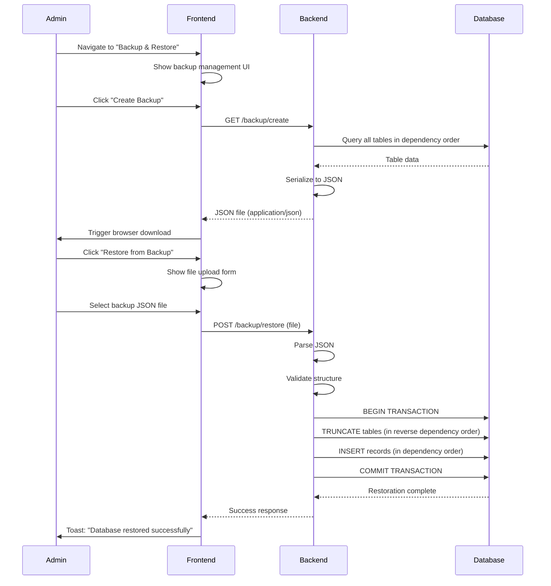
```mermaid
sequenceDiagram
    Admin->>Frontend: Navigate to "Backup & Restore"
    Frontend->>Frontend: Show backup management UI
    
    Admin->>Frontend: Click "Create Backup"
    Frontend->>Backend: GET /backup/create
    Backend->>Database: Query all tables in dependency order
    Database-->>Backend: Table data
    Backend->>Backend: Serialize to JSON
    Backend-->>Frontend: JSON file (application/json)
    Frontend->>Admin: Trigger browser download
    
    Admin->>Frontend: Click "Restore from Backup"
    Frontend->>Frontend: Show file upload form
    
    Admin->>Frontend: Select backup JSON file
    Frontend->>Backend: POST /backup/restore (file)
    Backend->>Backend: Parse JSON
    Backend->>Backend: Validate structure
    Backend->>Database: BEGIN TRANSACTION
    Backend->>Database: TRUNCATE tables (in reverse dependency order)
    Backend->>Database: INSERT records (in dependency order)
    Backend->>Database: COMMIT TRANSACTION
    Database-->>Backend: Restoration complete
    Backend-->>Frontend: Success response
    Frontend->>Admin: Toast: "Database restored successfully"
```

### Required Backend Endpoints (Admin)
- `POST /auth/login` - Admin authentication
- `POST /people` - Create professor
- `PUT /people/{id}` - Update professor
- `POST /careers` - Create career
- `POST /application-domains` - Create domain
- `POST /tags` - Create tag
- `GET /projects` - List projects (paginated, filtered)
- `POST /projects` - Create project
- `PUT /projects/{id}` - Update project
- `PUT /projects/{id}/tags` - Update project tags
- `POST /bulk/dataset/projects` - Bulk import/parse
- `GET /backup/create` - Export database as JSON
- `POST /backup/restore` - Restore database from JSON

---

## 2. Professor User Flow

### Purpose
Professors manage their research projects: updating project metadata, managing associated tags, specifying domain(s), and assigning completion dates. They also review the student list and can update project tags/topics.

### Key Responsibilities
- Request magic login link (passwordless auth)
- View projects assigned to them
- Update project information:
  - Add/remove project tags
  - Select application domain(s)
  - Assign completion date
  - Update student roster
  - Modify project description/title (if permitted)
- View analytics dashboard (read-only)

### User Flow Diagram

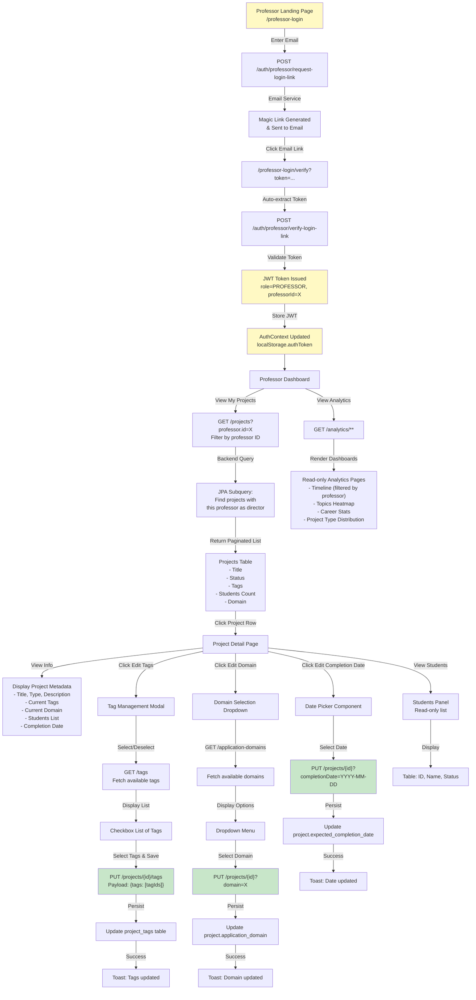
```mermaid
graph TD
    A["Professor Landing Page<br/>/professor-login"] -->|Enter Email| B["POST /auth/professor/request-login-link"]
    B -->|Email Service| C["Magic Link Generated<br/>& Sent to Email"]
    C -->|Click Email Link| D["/professor-login/verify?token=..."]
    D -->|Auto-extract Token| E["POST /auth/professor/verify-login-link"]
    E -->|Validate Token| F["JWT Token Issued<br/>role=PROFESSOR, professorId=X"]
    F -->|Store JWT| G["AuthContext Updated<br/>localStorage.authToken"]
    
    G --> H["Professor Dashboard"]
    H -->|View My Projects| I["GET /projects?professor.id=X<br/>Filter by professor ID"]
    I -->|Backend Query| J["JPA Subquery:<br/>Find projects with<br/>this professor as director"]
    J -->|Return Paginated List| K["Projects Table<br/>- Title<br/>- Status<br/>- Tags<br/>- Students Count<br/>- Domain"]
    
    K -->|Click Project Row| L["Project Detail Page"]
    L -->|View Info| M["Display Project Metadata<br/>- Title, Type, Description<br/>- Current Tags<br/>- Current Domain<br/>- Students List<br/>- Completion Date"]
    
    L -->|Click Edit Tags| N["Tag Management Modal"]
    N -->|Select/Deselect| O["GET /tags<br/>Fetch available tags"]
    O -->|Display List| P["Checkbox List of Tags"]
    P -->|Select Tags & Save| Q["PUT /projects/{id}/tags<br/>Payload: {tags: [tagIds]}"]
    Q -->|Persist| R["Update project_tags table"]
    R -->|Success| S["Toast: Tags updated"]
    
    L -->|Click Edit Domain| T["Domain Selection Dropdown"]
    T -->|GET /application-domains| U["Fetch available domains"]
    U -->|Display Options| V["Dropdown Menu"]
    V -->|Select Domain| W["PUT /projects/{id}?domain=X"]
    W -->|Persist| X["Update project.application_domain"]
    X -->|Success| Y["Toast: Domain updated"]
    
    L -->|Click Edit Completion Date| Z["Date Picker Component"]
    Z -->|Select Date| AA["PUT /projects/{id}?completionDate=YYYY-MM-DD"]
    AA -->|Persist| AB["Update project.expected_completion_date"]
    AB -->|Success| AC["Toast: Date updated"]
    
    L -->|View Students| AD["Students Panel<br/>Read-only list"]
    AD -->|Display| AE["Table: ID, Name, Status"]
    
    H -->|View Analytics| AF["GET /analytics/**"]
    AF -->|Render Dashboards| AG["Read-only Analytics Pages<br/>- Timeline (filtered by professor)<br/>- Topics Heatmap<br/>- Career Stats<br/>- Project Type Distribution"]
    
    style A fill:#fff9c4
    style F fill:#fff9c4
    style G fill:#fff9c4
    style Q fill:#c8e6c9
    style W fill:#c8e6c9
    style AA fill:#c8e6c9
```

### Step-by-Step Flow: Professor Updates Project Tags

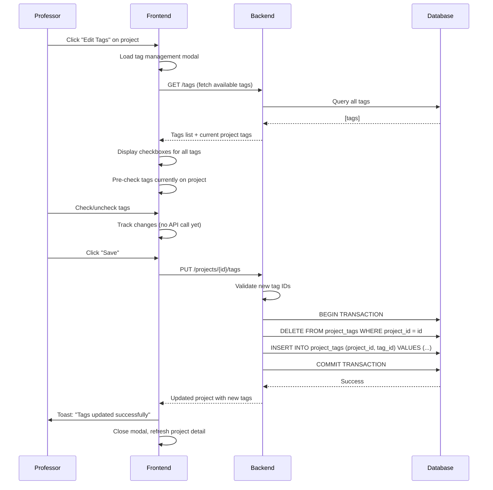
```mermaid
sequenceDiagram
    Professor->>Frontend: Click "Edit Tags" on project
    Frontend->>Frontend: Load tag management modal
    Frontend->>Backend: GET /tags (fetch available tags)
    Backend->>Database: Query all tags
    Database-->>Backend: [tags]
    Backend-->>Frontend: Tags list + current project tags
    
    Frontend->>Frontend: Display checkboxes for all tags
    Frontend->>Frontend: Pre-check tags currently on project
    
    Professor->>Frontend: Check/uncheck tags
    Frontend->>Frontend: Track changes (no API call yet)
    
    Professor->>Frontend: Click "Save"
    Frontend->>Backend: PUT /projects/{id}/tags
    Backend->>Backend: Validate new tag IDs
    Backend->>Database: BEGIN TRANSACTION
    Backend->>Database: DELETE FROM project_tags WHERE project_id = id
    Backend->>Database: INSERT INTO project_tags (project_id, tag_id) VALUES (...)
    Backend->>Database: COMMIT TRANSACTION
    Database-->>Backend: Success
    Backend-->>Frontend: Updated project with new tags
    Frontend->>Professor: Toast: "Tags updated successfully"
    Frontend->>Frontend: Close modal, refresh project detail
```

### Step-by-Step Flow: Professor Magic Link Login

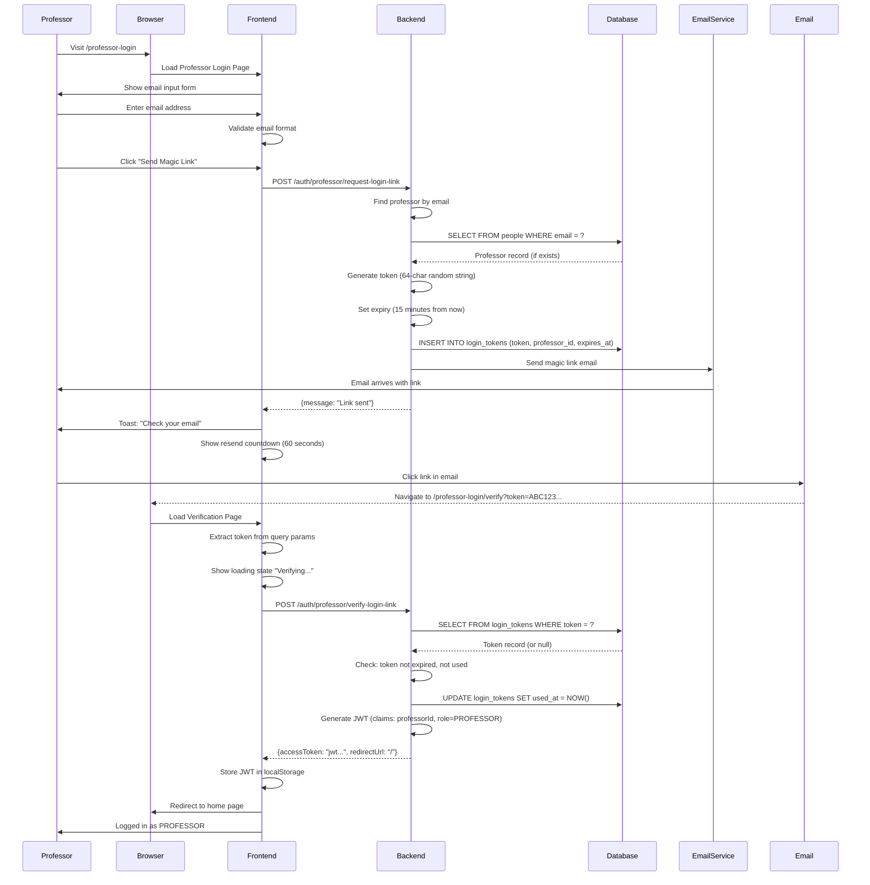
```mermaid
sequenceDiagram
    Professor->>Browser: Visit /professor-login
    Browser->>Frontend: Load Professor Login Page
    Frontend->>Professor: Show email input form
    
    Professor->>Frontend: Enter email address
    Frontend->>Frontend: Validate email format
    
    Professor->>Frontend: Click "Send Magic Link"
    Frontend->>Backend: POST /auth/professor/request-login-link
    Backend->>Backend: Find professor by email
    Backend->>Database: SELECT FROM people WHERE email = ?
    Database-->>Backend: Professor record (if exists)
    Backend->>Backend: Generate token (64-char random string)
    Backend->>Backend: Set expiry (15 minutes from now)
    Backend->>Database: INSERT INTO login_tokens (token, professor_id, expires_at)
    Backend->>EmailService: Send magic link email
    EmailService->>Professor: Email arrives with link
    Backend-->>Frontend: {message: "Link sent"}
    Frontend->>Professor: Toast: "Check your email"
    Frontend->>Frontend: Show resend countdown (60 seconds)
    
    Professor->>Email: Click link in email
    Email-->>Browser: Navigate to /professor-login/verify?token=ABC123...
    Browser->>Frontend: Load Verification Page
    Frontend->>Frontend: Extract token from query params
    Frontend->>Frontend: Show loading state "Verifying..."
    Frontend->>Backend: POST /auth/professor/verify-login-link
    Backend->>Database: SELECT FROM login_tokens WHERE token = ?
    Database-->>Backend: Token record (or null)
    Backend->>Backend: Check: token not expired, not used
    Backend->>Database: UPDATE login_tokens SET used_at = NOW()
    Backend->>Backend: Generate JWT (claims: professorId, role=PROFESSOR)
    Backend-->>Frontend: {accessToken: "jwt...", redirectUrl: "/"}
    Frontend->>Frontend: Store JWT in localStorage
    Frontend->>Browser: Redirect to home page
    Frontend->>Professor: Logged in as PROFESSOR
```

### Required Backend Endpoints (Professor)
- `POST /auth/professor/request-login-link` - Request magic link
- `POST /auth/professor/verify-login-link` - Verify token & get JWT
- `GET /projects?professor.id=X` - List professor's projects
- `GET /projects/{id}` - Get project details
- `PUT /projects/{id}/tags` - Update project tags
- `PUT /projects/{id}` - Update project metadata (domain, completion date, etc.)
- `GET /tags` - List available tags
- `GET /application-domains` - List available domains
- `GET /analytics/**` - Analytics endpoints (read-only)

---

## 3. Student User Flow

### Purpose
Students browse available research projects and view analytics dashboards showing project metadata, professor networks, and domain/topic distributions. This is a **public, read-only** interface with no authentication required.

### Key Responsibilities
- Browse project catalog (public view)
- Filter projects by:
  - Domain (career/application area)
  - Tags/Topics
  - Professor
  - Project type
  - Status/Completion year
- View project details:
  - Title, description, project type
  - Assigned professors
  - Application domain
  - Topics/tags
  - Expected completion date
- View analytics dashboards (all public):
  - Project timeline (by year/professor)
  - Topic heatmap (tag frequency by year)
  - Professor collaboration network
  - Career/domain statistics
  - Overall project distribution

### User Flow Diagram

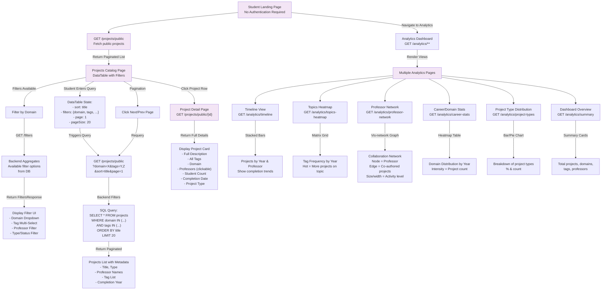
```mermaid
graph TD
    A["Student Landing Page<br/>No Authentication Required"] --> B["GET /projects/public<br/>Fetch public projects"]
    B -->|Return Paginated List| C["Projects Catalog Page<br/>DataTable with Filters"]
    
    C -->|Filters Available| D["Filter by Domain"]
    D -->|GET /filters| E["Backend Aggregates<br/>Available filter options<br/>from DB"]
    E -->|Return FiltersResponse| F["Display Filter UI<br/>- Domain Dropdown<br/>- Tag Multi-Select<br/>- Professor Filter<br/>- Type/Status Filter"]
    
    C -->|Student Enters Query| G["DataTable State:<br/>- sort: title<br/>- filters: {domain, tags, ...}<br/>- page: 1<br/>- pageSize: 20"]
    G -->|Triggers Query| H["GET /projects/public<br/>?domain=X&tags=Y,Z<br/>&sort=title&page=1"]
    H -->|Backend Filters| I["SQL Query:<br/>SELECT * FROM projects<br/>WHERE domain IN (...)<br/>AND tags IN (...)<br/>ORDER BY title<br/>LIMIT 20"]
    I -->|Return Paginated| J["Projects List with Metadata<br/>- Title, Type<br/>- Professor Names<br/>- Tag List<br/>- Completion Year"]
    
    C -->|Click Project Row| K["Project Detail Page<br/>GET /projects/public/{id}"]
    K -->|Return Full Details| L["Display Project Card<br/>- Full Description<br/>- All Tags<br/>- Domain<br/>- Professors (clickable)<br/>- Student Count<br/>- Completion Date<br/>- Project Type"]
    
    C -->|Pagination| M["Click Next/Prev Page"]
    M -->|Requery| H
    
    A -->|Navigate to Analytics| N["Analytics Dashboard<br/>GET /analytics/**"]
    N -->|Render Views| O["Multiple Analytics Pages"]
    
    O --> P["Timeline View<br/>GET /analytics/timeline"]
    P -->|Stacked Bars| Q["Projects by Year & Professor<br/>Show completion trends"]
    
    O --> R["Topics Heatmap<br/>GET /analytics/topics-heatmap"]
    R -->|Matrix Grid| S["Tag Frequency by Year<br/>Hot = More projects on topic"]
    
    O --> T["Professor Network<br/>GET /analytics/professor-network"]
    T -->|Vis-network Graph| U["Collaboration Network<br/>Node = Professor<br/>Edge = Co-authored projects<br/>Size/width = Activity level"]
    
    O --> V["Career/Domain Stats<br/>GET /analytics/career-stats"]
    V -->|Heatmap Table| W["Domain Distribution by Year<br/>Intensity = Project count"]
    
    O --> X["Project Type Distribution<br/>GET /analytics/project-types"]
    X -->|Bar/Pie Chart| Y["Breakdown of project types<br/>% & count"]
    
    O --> Z["Dashboard Overview<br/>GET /analytics/summary"]
    Z -->|Summary Cards| AA["Total projects, domains,<br/>tags, professors"]
    
    style A fill:#f3e5f5
    style B fill:#f3e5f5
    style C fill:#f3e5f5
    style K fill:#f3e5f5
    style O fill:#f3e5f5
```

### Step-by-Step Flow: Student Browses & Filters Projects

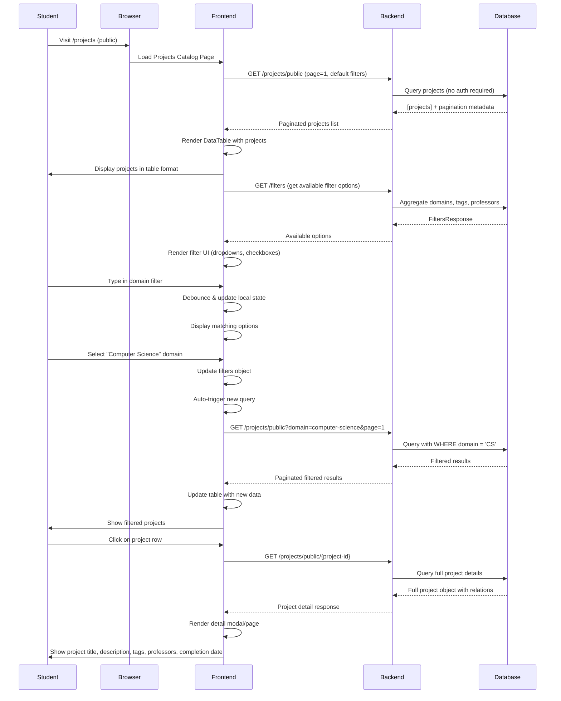
```mermaid
sequenceDiagram
    Student->>Browser: Visit /projects (public)
    Browser->>Frontend: Load Projects Catalog Page
    Frontend->>Backend: GET /projects/public (page=1, default filters)
    Backend->>Database: Query projects (no auth required)
    Database-->>Backend: [projects] + pagination metadata
    Backend-->>Frontend: Paginated projects list
    Frontend->>Frontend: Render DataTable with projects
    Frontend->>Student: Display projects in table format
    
    Frontend->>Backend: GET /filters (get available filter options)
    Backend->>Database: Aggregate domains, tags, professors
    Database-->>Backend: FiltersResponse
    Backend-->>Frontend: Available options
    Frontend->>Frontend: Render filter UI (dropdowns, checkboxes)
    
    Student->>Frontend: Type in domain filter
    Frontend->>Frontend: Debounce & update local state
    Frontend->>Frontend: Display matching options
    
    Student->>Frontend: Select "Computer Science" domain
    Frontend->>Frontend: Update filters object
    Frontend->>Frontend: Auto-trigger new query
    Frontend->>Backend: GET /projects/public?domain=computer-science&page=1
    Backend->>Database: Query with WHERE domain = 'CS'
    Database-->>Backend: Filtered results
    Backend-->>Frontend: Paginated filtered results
    Frontend->>Frontend: Update table with new data
    Frontend->>Student: Show filtered projects
    
    Student->>Frontend: Click on project row
    Frontend->>Backend: GET /projects/public/{project-id}
    Backend->>Database: Query full project details
    Database-->>Backend: Full project object with relations
    Backend-->>Frontend: Project detail response
    Frontend->>Frontend: Render detail modal/page
    Frontend->>Student: Show project title, description, tags, professors, completion date
```

### Step-by-Step Flow: Student Views Analytics Dashboard

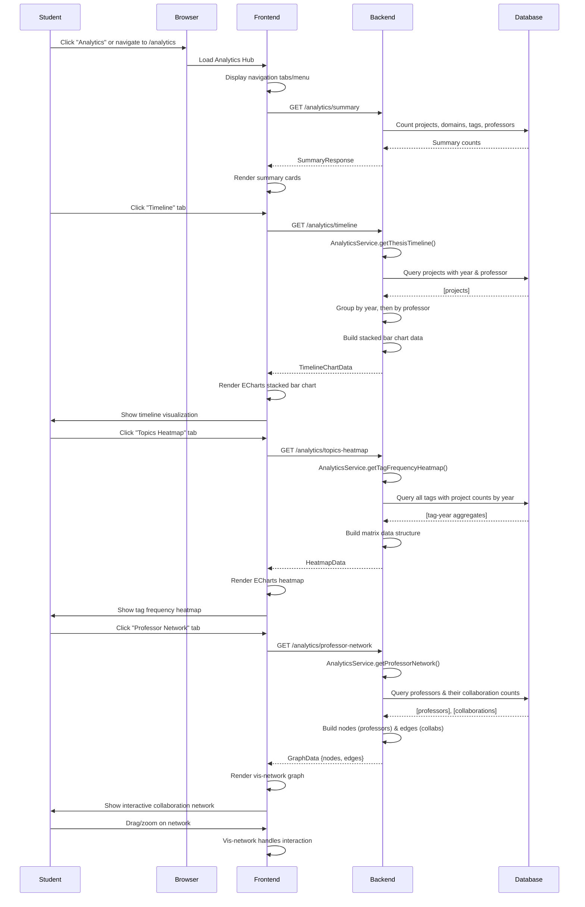
```mermaid
sequenceDiagram
    Student->>Browser: Click "Analytics" or navigate to /analytics
    Browser->>Frontend: Load Analytics Hub
    Frontend->>Frontend: Display navigation tabs/menu
    
    Frontend->>Backend: GET /analytics/summary
    Backend->>Database: Count projects, domains, tags, professors
    Database-->>Backend: Summary counts
    Backend-->>Frontend: SummaryResponse
    Frontend->>Frontend: Render summary cards
    
    Student->>Frontend: Click "Timeline" tab
    Frontend->>Backend: GET /analytics/timeline
    Backend->>Backend: AnalyticsService.getThesisTimeline()
    Backend->>Database: Query projects with year & professor
    Database-->>Backend: [projects]
    Backend->>Backend: Group by year, then by professor
    Backend->>Backend: Build stacked bar chart data
    Backend-->>Frontend: TimelineChartData
    Frontend->>Frontend: Render ECharts stacked bar chart
    Frontend->>Student: Show timeline visualization
    
    Student->>Frontend: Click "Topics Heatmap" tab
    Frontend->>Backend: GET /analytics/topics-heatmap
    Backend->>Backend: AnalyticsService.getTagFrequencyHeatmap()
    Backend->>Database: Query all tags with project counts by year
    Database-->>Backend: [tag-year aggregates]
    Backend->>Backend: Build matrix data structure
    Backend-->>Frontend: HeatmapData
    Frontend->>Frontend: Render ECharts heatmap
    Frontend->>Student: Show tag frequency heatmap
    
    Student->>Frontend: Click "Professor Network" tab
    Frontend->>Backend: GET /analytics/professor-network
    Backend->>Backend: AnalyticsService.getProfessorNetwork()
    Backend->>Database: Query professors & their collaboration counts
    Database-->>Backend: [professors], [collaborations]
    Backend->>Backend: Build nodes (professors) & edges (collabs)
    Backend-->>Frontend: GraphData {nodes, edges}
    Frontend->>Frontend: Render vis-network graph
    Frontend->>Student: Show interactive collaboration network
    
    Student->>Frontend: Drag/zoom on network
    Frontend->>Frontend: Vis-network handles interaction
```

### Required Backend Endpoints (Public/Student)
- `GET /projects/public` - List public projects (paginated, filtered)
- `GET /projects/public/{id}` - Get public project details
- `GET /filters` - Get available filter options
- `GET /analytics/summary` - Overall statistics
- `GET /analytics/timeline` - Projects by year & professor
- `GET /analytics/topics-heatmap` - Tag frequency matrix
- `GET /analytics/professor-network` - Collaboration graph data
- `GET /analytics/career-stats` - Domain distribution
- `GET /analytics/project-types` - Project type breakdown

---

## 4. Authentication & Authorization Matrix

| Endpoint | Admin | Professor | Student | Public |
|----------|-------|-----------|---------|--------|
| `POST /auth/login` | ✅ | ❌ | ❌ | ✅ (public) |
| `POST /auth/professor/request-login-link` | ❌ | ✅ | ❌ | ✅ (public) |
| `POST /auth/professor/verify-login-link` | ❌ | ✅ | ❌ | ✅ (public) |
| `GET /projects` | ✅ (all) | ✅ (own) | ❌ | ❌ |
| `POST /projects` | ✅ | ❌ | ❌ | ❌ |
| `PUT /projects/{id}` | ✅ | ✅ (own) | ❌ | ❌ |
| `PUT /projects/{id}/tags` | ✅ | ✅ (own) | ❌ | ❌ |
| `GET /projects/public` | ✅ | ✅ | ✅ | ✅ (public) |
| `GET /projects/public/{id}` | ✅ | ✅ | ✅ | ✅ (public) |
| `GET /people` | ✅ | ✅ (read-only) | ❌ | ❌ |
| `POST /people` | ✅ | ❌ | ❌ | ❌ |
| `GET /students` | ✅ | ✅ (read-only) | ❌ | ❌ |
| `GET /tags` | ✅ | ✅ (read-only) | ❌ | ❌ |
| `GET /careers` | ✅ | ✅ (read-only) | ❌ | ❌ |
| `GET /application-domains` | ✅ | ✅ (read-only) | ❌ | ❌ |
| `GET /analytics/**` | ✅ | ✅ | ✅ | ✅ (public) |
| `POST /backup/create` | ✅ | ❌ | ❌ | ❌ |
| `POST /backup/restore` | ✅ | ❌ | ❌ | ❌ |
| `POST /bulk/dataset/projects` | ✅ | ❌ | ❌ | ❌ |

---

## 5. Data Flow Summary

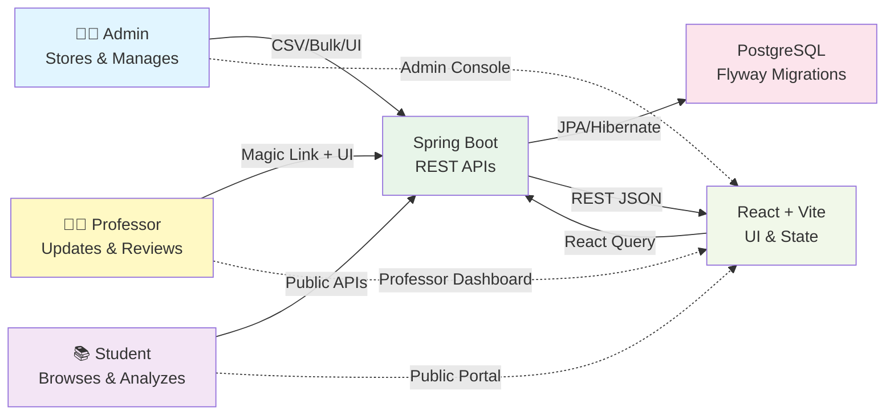
```mermaid
graph LR
    Admin["👨‍💼 Admin<br/>Stores & Manages"]
    Prof["👨‍🎓 Professor<br/>Updates & Reviews"]
    Stud["📚 Student<br/>Browses & Analyzes"]
    
    DB["PostgreSQL<br/>Flyway Migrations"]
    Backend["Spring Boot<br/>REST APIs"]
    Frontend["React + Vite<br/>UI & State"]
    
    Admin -->|CSV/Bulk/UI| Backend
    Prof -->|Magic Link + UI| Backend
    Stud -->|Public APIs| Backend
    
    Backend -->|JPA/Hibernate| DB
    
    Backend -->|REST JSON| Frontend
    Frontend -->|React Query| Backend
    
    Admin -.->|Admin Console| Frontend
    Prof -.->|Professor Dashboard| Frontend
    Stud -.->|Public Portal| Frontend
    
    style Admin fill:#e1f5ff
    style Prof fill:#fff9c4
    style Stud fill:#f3e5f5
    style Backend fill:#e8f5e9
    style DB fill:#fce4ec
    style Frontend fill:#f1f8e9
```

---

## 6. Key Integration Points

### Authentication Flow
1. **Admin**: Credentials → `/auth/login` → JWT with role=ADMIN
2. **Professor**: Email → `/auth/professor/request-login-link` → Magic token → `/auth/professor/verify-login-link` → JWT with role=PROFESSOR
3. **Student**: No auth required (public access)

### Project Lifecycle
1. **Creation** (Admin): Create via UI wizard or bulk import
2. **Metadata** (Admin/Professor): Add tags, domain, completion date
3. **Query** (All): Public endpoints for projects/analytics
4. **Analytics**: Backend aggregates data, frontend visualizes

### Data Visibility
- **Admin**: All data, with management capabilities
- **Professor**: Their own projects + public data + read-only catalogs
- **Student**: Public project data + public analytics only

---

## 7. Technology Stack Alignment

| Layer | Technology | Purpose |
|-------|-----------|---------|
| **Frontend UI** | React 19 + TypeScript + Vite | Component rendering, state management (React Query) |
| **Backend API** | Spring Boot 3 + Kotlin | REST endpoints, business logic, authentication |
| **Database** | PostgreSQL + Flyway | Persistent storage, schema migrations |
| **Auth** | JWT + Spring Security | Stateless authentication & authorization |
| **Email** | Spring Mail + Mailtrap | Magic link delivery |
| **Analytics** | ECharts + Recharts + vis-network | Data visualization |

---

## 8. Future Enhancements

- **Professor**: Ability to assign students to projects (currently admin-only)
- **Student**: Ability to request/apply for projects
- **Admin**: Granular role-based access control (RBACs) per user
- **Analytics**: Database-level aggregations for performance at scale
- **Frontend**: Edit flows for all entity types, not just project tags
- **Audit Trail**: Track all mutations for compliance

---

**Document Version:** 1.0  
**Last Updated:** 2025-11-24  
**Status:** Complete
